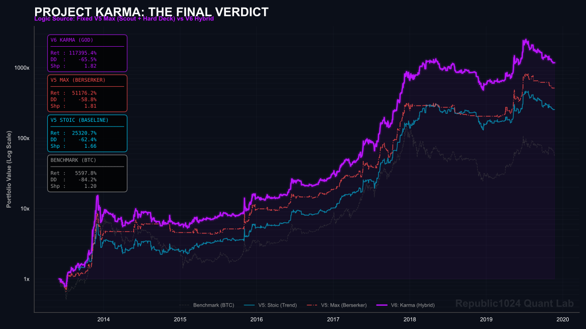

# Project Karma: A Macro-Micro Resonance Framework for Bitcoin

> **"Quantity becomes Quality."** — Processing 16.8 Million Tweets to challenge the Efficient Market Hypothesis.

## 📖 Executive Summary

**Project Karma** is a quantitative trading engine evolved to solve the "Quantitative Impossible Trinity" (High Return, Low Drawdown, High Capacity) in the cryptocurrency market. 

Unlike traditional approaches that dismiss retail sentiment as noise, this engine distills a high-fidelity **"Viral Sentiment"** factor using a RoBERTa-based Transformer pipeline. It fuses two distinct market logics:

1.  **The Micro-Stoic (High Frequency):** Exploiting short-term sentiment momentum using NLP-derived signals.
2.  **The Macro-God (Low Frequency):** Enforcing a Regime Shift filter (`MA60`/`MA100`) to enable aggressive leverage during confirmed bull runs while deploying a **"Hybrid Sentiment Fuse"** to survive catastrophic crashes.

## 🏆 The Final Verdict: Performance Matrix (2013-2019)

| **Metric** | **Benchmark (BTC)** | **V5 Stoic (Baseline)** | **V5 Max (Berserker)** | **V6 Karma (God Engine)** |
| :--- | :--- | :--- | :--- | :--- |
| **Logic Core** | Buy & Hold | Trend Following | **High Leverage (2.0x)** | **Hybrid Resonance** |
| **Total Return** | 5,597.8% (55x) | **25,320%** (253x) | **51,176%** (511x) | **117,395%** (1,173x) |
| **Max Drawdown** | -84.2% | -66.91% | **-58.75%** | **-65.50%** |
| **Sharpe Ratio** | 1.20 | 1.66 | **1.81** | **1.82** |
| **Calmar Ratio** | 0.66 | 3.78 | 8.71 | **17.92** |
| **Risk Character** | Passive Market | Conservative | **Aggressive & Fragile** | **Antifragile** |

> **Analyst Note:** > **V6 Karma** introduces the *Hybrid Fuse*. While V5 Max was forced to exit completely during shocks (the "Hard Deck"), Karma shifts gears, capturing the rebounds that mechanical strategies miss.

---

## 🧬 Strategy Architecture

The engine operates on a 5-Gear Transmission system, adjusting exposure based on the resonance between Price Structure and Crowd Psychology.

* **⚙️ Gear 0 (0.0x) - Hard Fuse:** `Bear Market` + `Panic` -> **Cash is King.**
* **⚙️ Gear 1 (0.5x) - Smart Base:** `Bull Market` + `Sentiment Dip` -> **Defensive Long.**
* **⚙️ Gear 2 (1.0x) - Standard:** `Bear Market` + `Trend Up` -> **Reversion Play.**
* **⚙️ Gear 3 (1.2x) - Resonance:** `Bull Market` + `Sentiment Up` -> **Aggressive Growth.**
* **⚙️ Gear 4 (1.8x) - God Mode:** `Bull Market` + `Nitro Sentiment` -> **Maximum Alpha.**

---

## 🛠️ Tech Stack & Engineering

* **ETL Engine:** `Polars` (Rust-based DataFrame) for high-performance processing of 16.8M rows.
* **NLP Core:** `RoBERTa-based Transformer` / `VADER` (Optimized) for sentiment scoring.
* **Backtest:** Custom vector-based backtesting engine (No loops, pure `NumPy`/`Pandas` vectorization).
* **Anti-Scam:** Regex-based "Anti-Scam v2.0" filter to purge bot networks and "Giveaway" spam.

## 🚀 Visuals

## ⚠️ Disclaimer

This project is for **educational and research purposes only**. Past performance (even 1,173x) is not indicative of future results. The crypto market is highly volatile. Do not trade with money you cannot afford to lose.

---

**Author:** [Republic1024](https://github.com/Republic1024)